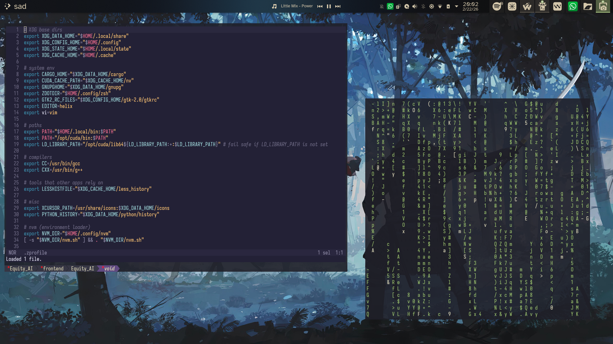

# dotfiles
A better $HOME, a better me.

## Screenshots
<div align="center">
  
  
</div>

## setting up the dotfiles 
```
git clone --separate-git-dir=$HOME/.dots git@github.com:xevansz/dots.git tmpdir
rsync --recursive --verbose --exclude '.git' tmpdir/ $HOME
rm -r tmpdir
```

## theme
- colors - Everforest, compline and kanagawa for everything.
- fonts - iosevka and atkinson hyperlegible or ttf-readex-pro.
- icons - Colloid icon theme purple.
- panel colorizer for dock
- install websockets pip for kurve
**Backed up using konsave.**

## script
```
curl -fsSL https://raw.githubusercontent.com/xevansz/dots/refs/heads/master/.config/scripts/installer.sh | bash
```

## water fox cleanup
```
cache2/
startupCache/
minidumps/
crashes/
storage/temporary/
weave/logs/
*.sqlite-wal
*.sqlite-shm
lock
AlternateServices.bin
SiteSecurityServiceState.bin
addonStartup.json.lz4
```
extensions
`media downloader unleashes`


